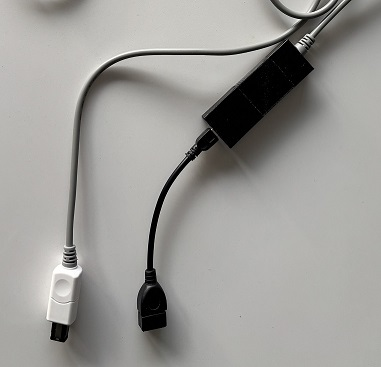
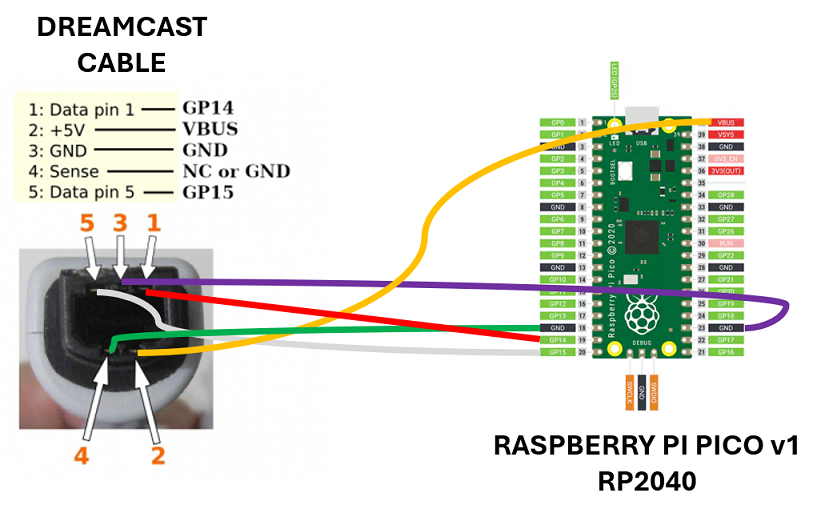
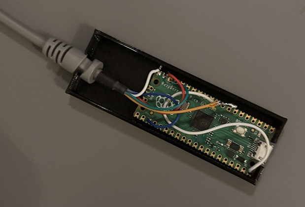
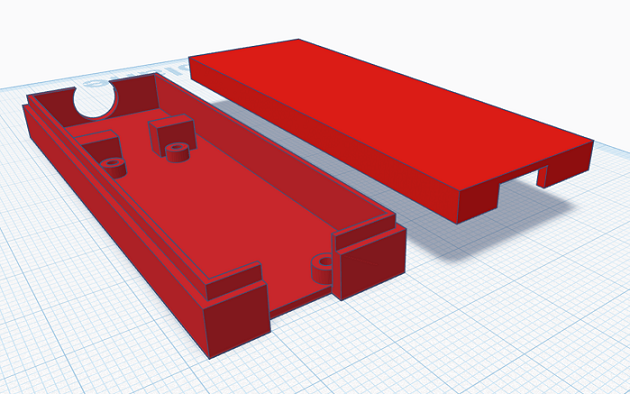

# dreamcast2usb-howto

# Dreamcast Controller To USB Adapter

Credit goes to megavolt85 for the firmware and key mapping. 
All detailed information that I used can be found [here](https://www.dreamcast-talk.com/forum/viewtopic.php?f=5&t=17404)

# Prerequisites
1. Raspberry Pi Pico RP2040 ($4) https://www.raspberrypi.com/products/raspberry-pi-pico/
2. USB OTG cable for the desired USB type ($9)
3. Spare Dreamcast controller cable ($6) or recovered from broken controller
4. Soldering gear: soldering iron, tin, flux. Alternatively: hotgluegun.
5. A case to protect the board and wires. I made a generic casing for mine that you can download below. Alternatively use a plastic container and cut holes in it.

To connect on the USB end:
1. Controller: XBOX 360 controller, both wired and wireless using a USB receiver for x360 controllers (it is also possible to connect an RF module from xbox 360 FAT). Playstation 3 only partially supported. Check the link at the top for more information on compatibility
2. USB keyboard / USB mouse for games that support it
3. USB flash drive for VMU emulation (USB hub required). I just need my saves so I leave a second controller plugged in with my VMUs

# Software
1. Download usb4maple(31.10.24).7z from [here](fw/usb4maple(31.10.24).7z)
2. Unpack the file
3. Press the button on the Raspberry Pi Pico while connecting it to a computer
4. A new drive appears. Release the button.
5. Copy the KMJ2DC.uf2 file to the drive. It will automatically close the window and remove itself from the system

# Wiring
Depending on what kind of controller wire you have, you will need to determine what pin on the connector end corresponds with what color wire. Strip the wires if they are not exposed yet. 
Use a multimeter and connect one probe to a controller pin and with the other probe wire. Set it to 200 Ohm and when connecting the wires see if you get a value different from 0. Or if your multimeter has a continuity mode (usually marked with a diode symbol or sound wave icon) then it checks resistance and adds a beep if the resistance is very low.

# Solder the wires, see the following schematic:

Note: I had to solder an extra piece of wire to reach the power connector.

If you do not want to solder you can probably put the wire through each connector hole on the Pico, butterfly twist the wire and and then hotglue it. Might not survive long term heavy handling.

# Casing
Generic casing for the board and wires in .stl format available [here](case/dreamcast%20adapter%20case.stl). It's a bit wider than a normal casing but I needed a bit more space for the soldered wires and I did want to start cutting plastic on the fat connector part of the wire. It might not click perfectly so I use tape for reinforcement.

Alternatively use a plastic container and cut holes in it.

# Testing
1. Connect your USB OTG cable and hook up a XBOX controller.
2. Test out a game e.g. Quake III Arena

Read all the information at https://www.dreamcast-talk.com/forum/viewtopic.php?f=5&t=17404

# EOF
